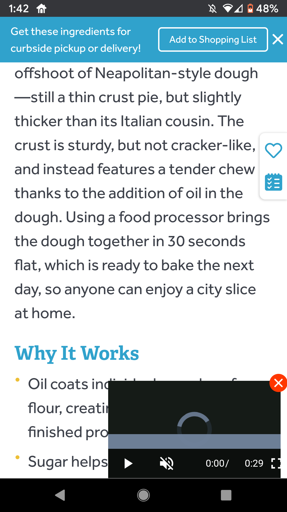

This is a collection of recipes we make on a regular basis.

### Why?
My favorite format for following a recipe in the kitchen is the good old-fashioned hard (paper) copy. Obviously there is a lot of useful stuff on the 'net, but scrolling back and forth on a small screen that regularly turns off is a pain. However, most websites format their recipes with these characteristics:
- A pop up asking you to sign up for their newsletter
- A wall of text describing the pattern of the tablecloth at the author's friends' grandmas house where they first ate this dish
- A full-HD video streaming one video after another, complete with ads, that condenses to a "handy" mini-player.

### Some notes and caveats
- Lots of people might say "any serious cook needs a kitchen scale", but I disagree - _every_ cook needs a kitchen scale! I use it primarily to reduce the number of things I need to wash, but it also helps in making recipes more consistent.
- I'm not always sure how to categorize things: Are crepes a breakfast food? I have a "mexican" category -- why not one for French food? (A: Probably because many of the dishes I like are not "authentic" (whatever that means) versions of some pre-colonial recipe)
- Along those lines, I am not a culinary historian, and don't intend to weigh in to political boundaries via recipe blog tagging. In general, things fall into a category based on the type of restaurant you'd find it on the menu. Also, Vietnamese and Thai = SE Asia; stuff with lots of curry powder == S Asia; stir fries with lots of sesame oil flavor == E Asia.

